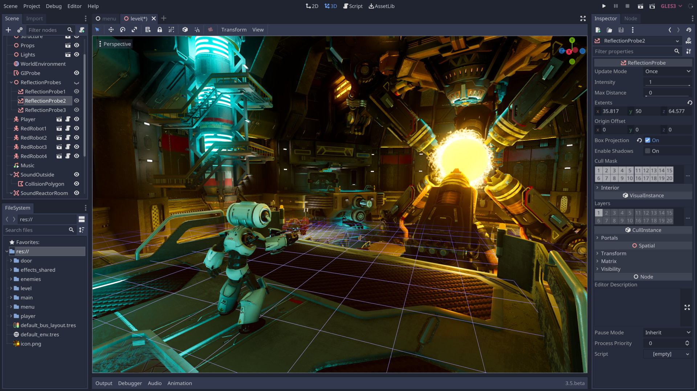

## Cos'è Godot?

Rompere le catene con Godot: la natura open source di Godot libera gli sviluppatori dai vincoli dei costi di licenza tradizionali. Si erge a testimonianza del potere collaborativo della comunità di sviluppo globale. Questa libertà consente agli sviluppatori indipendenti di concentrarsi sulla creazione di giochi unici e avvincenti senza barriere finanziarie.

Scripting visivo scatenato: per coloro che trovano conforto nei flussi di lavoro visivi, il sistema di scripting visivo di Godot diventa un parco giochi per la creatività. Questo approccio drag-and-drop alla logica del gioco consente agli sviluppatori di iterare rapidamente e sperimentare idee senza sforzo. Lo scripting visivo non è solo una comodità; è un catalizzatore per abbattere le barriere all'ingresso nello sviluppo del gioco.

GDScript - Un linguaggio per l'espressione: GDScript di Godot offre un linguaggio di scripting che raggiunge un equilibrio armonioso tra semplicità e capacità. Traendo ispirazione da Python, GDScript facilita l'espressione fluida di meccaniche di gioco complesse. È un linguaggio invitante per i principianti e uno strumento versatile per gli sviluppatori esperti per creare sistemi complessi all'interno dei loro giochi.

Sistema di nodi per lo sviluppo strutturato: la scena e il sistema di nodi di Godot rivoluzionano l'organizzazione del gioco. Le scene, costruite come gerarchie di nodi, favoriscono un ambiente di sviluppo modulare e organizzato. Questa struttura migliora la collaborazione, facilita la riusabilità e semplifica la creazione di giochi sia 2D che 3D.

Eccellenza 2D e 3D: Godot non scende a compromessi sulla profondità delle esperienze che può dare vita. Il suo motore 2D garantisce una precisione pixel-perfetta ed è completato da un motore 3D altrettanto robusto. Dalla creazione di narrazioni 2D accattivanti alla costruzione di mondi 3D coinvolgenti, Godot soddisfa le diverse visioni degli sviluppatori indipendenti.

Esportare i sogni in realtà: gli sviluppatori indipendenti sognano che i loro giochi raggiungano un vasto pubblico e Godot rende questo sogno realizzabile. Con un sistema di esportazione fluido, gli sviluppatori possono lanciare le loro creazioni su piattaforme che vanno dal desktop al mobile, estendendosi anche alle console. Questa accessibilità democratizza la distribuzione dei giochi indie.

[Official Website](https://godotengine.org/)