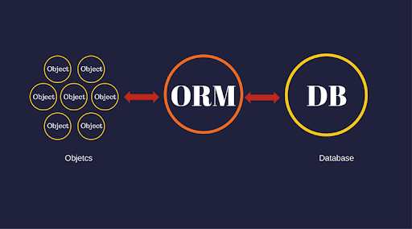

NHibernate è un framework di mapping oggetto-relazionale (ORM) che offre agli sviluppatori .NET un modo semplice ed efficiente per gestire l'interazione tra le applicazioni e i database relazionali. Nato come porting di Hibernate, un popolare framework per Java, NHibernate fornisce agli sviluppatori .NET uno strumento potente per mappare le classi del dominio agli schemi dei database, consentendo così di scrivere codice più pulito e manutenibile.

## Cos'è NHibernate?

NHibernate è una libreria open-source che semplifica l'accesso ai dati in applicazioni .NET, consentendo agli sviluppatori di lavorare con oggetti del dominio anziché dover scrivere query SQL direttamente. Utilizzando NHibernate, è possibile definire le relazioni tra gli oggetti del dominio in modo naturale, senza doversi preoccupare della complessità dei dettagli di implementazione della persistenza dei dati.

### Perchè NHibernate è importante?

NHibernate offre una serie di vantaggi significativi per lo sviluppo di applicazioni .NET:

Astrazione del Database:
NHibernate astrae i dettagli specifici del database, consentendo agli sviluppatori di scrivere codice indipendente dal tipo di database sottostante. Questo significa che è possibile sviluppare applicazioni che possono facilmente cambiare il database di backend senza dover modificare il codice dell'applicazione.

2. Mapping Object-Relational (ORM): NHibernate semplifica il processo di mapping delle classi del dominio agli schemi dei database. Utilizzando file di mapping XML o attributi, gli sviluppatori possono definire facilmente come le classi del dominio sono rappresentate nel database relazionale.

3. Gestione delle Relazioni: NHibernate facilita la gestione delle relazioni tra gli oggetti del dominio. È possibile definire associazioni uno-a-uno, uno-a-molti e molti-a-molti in modo intuitivo, semplificando la progettazione e l'implementazione delle relazioni complesse.

4. Performance Ottimizzata: NHibernate offre funzionalità come il caricamento pigro (lazy loading) e la cache di secondo livello, che possono migliorare le prestazioni dell'applicazione riducendo il numero di query eseguite sul database e ottimizzando l'accesso ai dati.

#### Conclusioni

NHibernate è uno strumento potente per lo sviluppo di applicazioni .NET basate su database, che offre agli sviluppatori un modo semplice ed efficace per gestire l'accesso ai dati. Con la sua capacità di astrazione del database, mapping object-relational e gestione delle relazioni, NHibernate semplifica notevolmente lo sviluppo di applicazioni robuste e scalabili. Nei prossimi articoli, esploreremo in dettaglio le funzionalità e le migliori pratiche di NHibernate per consentirti di sfruttare appieno questo potente framework ORM.

