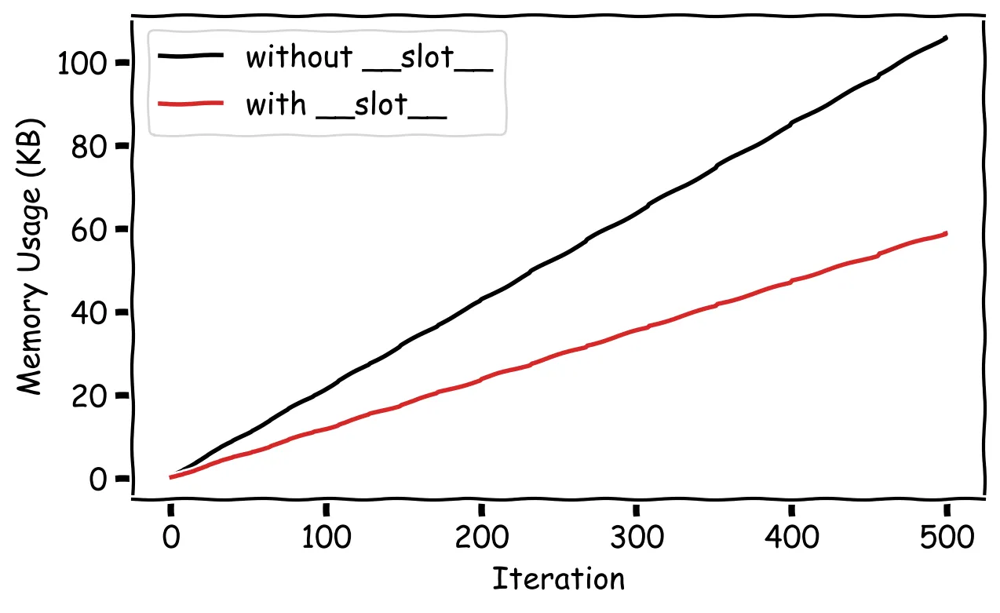

When writing python code, loops are not the only place where we need to be mindful of memory usage. In data-related projects and object-oriented code development, it is important to make sure that our classes are also memory efficient. Often, we invest a significant amount of time designing and writing complex and intricate classes, only to discover that they perform poorly in testing or production due to the large amount of data they need to carry.

By following the techniques and approaches discussed in the article, you can create classes that optimize memory usage and improve overall performance. This blog post explores three techniques and recommended approaches for creating memory-efficient Python classes.

## 1. Use ```__slots__```

Using Python’s ```__slots__``` dunder, you can explicitly define the attributes that a class can ever possess. This generally helps optimize the memory usage of our classes by avoiding the creation of a dynamic dictionary for attribute storage.

By default, Python classes store their instance attributes in a private dictionary ``` (__dict__)``` . This dictionary allows for a lot of flexibility, as you can add, modify, or delete the class attributes at runtime. However, this flexibility usually comes at the cost of memory overhead. Each instance of the class has a dictionary that stores attribute names and values as key-values pairs. When using ``` __slots__``` , Python reserves only a fixed amount of space for the specified attributes directly in each instance, instead of using the default dictionary.

Here’s an example of a Python class that uses ``` __slots__```  to increase memory efficiency:

```python title="file.py"
class Ant:
    __slots__ = ['worker_id', 'role', 'colony']

    def __init__(self, worker_id, role, colony):
        self.worker_id = worker_id
        self.role = role
        self.colony = colony

# Instantiate multiple Ant objects
ant0 = Ant("Q", "Queen", "Red Colony")
ant1 = Ant("W1", "Worker", "Red Colony")
ant2 = Ant("W2", "Worker", "Red Colony")
ant3 = Ant("S1", "Soldier", "Red Colony")
``` 

In this example, the Ant class uses ```__slots__``` to explicitly define the attributes ```worker_id```, ```role```, and ```colony```. This specificity prevents the creation of a dynamic dictionary for attribute storage, and results in saving memory when creating multiple instances of the ```Ant``` class.

The benefits of using ```__slots__``` become even more significant when you need to create a large number of instances of a class (e.g. when creating an ant colony). Without ```__slots__``` , the overhead of using the attribute dictionary (python’s default) can become substantial, leading to increased memory usage and possibly slower performance.

Let’s consider a ```Colony``` class that contains a list of ant members as follows:

```python
class Colony:
    def __init__(self, name):
	self.name = name
        self.ants = []

    def add_ant(self, worker_id, role):
        ant = Ant(worker_id, role, self.name)
        self.ants.append(ant)

    def distribute_work(self):
        # add code to distribute work among the ants
        pass

    def defend_queen(self):
        # add code to defend the queen
        pass
```

Now let’s instantiate a colony and run through a loop and add 500,000 ants to the instance:

```python
# Create an instance of Colony
colony_name = "Tinyopolis"
colony = Colony(colony_name)

# Simulate an ant colony of 500,000 worker ants
n_ants = 500_000
for i in range(n_ants):
    worker_id = f"W{i}"
    role = "Worker"
    colony.add_ant(worker_id, role)
```

Since we are instantiating the ```Ant()``` class over and over, we will certainly benefit from using ```__slots__``` to reduce the memory footprint. You can validate this fact by profiling the memory usage of this loop using the ```pympler``` package (see here for example usage). When we compare the memory usage per iteration of the class that uses __slots__ with the one that does not, we get the following:



Here you can see that using ```__slots__``` uses only about half the amount of memory as the class that is defined traditionally (which uses ```__dict__``` by default).

It’s important to note that using ```__slots__``` restricts the attributes that can be assigned to an instance, i.e. only the attributes listed in ```__slots__``` can be assigned and accessed directly on the instance. Any attempt to assign an attribute that is not listed in ```__slots__``` will raise an AttributeError. This can help prevent creating accidental attributes due to typos, but it can also be restrictive if you need to add additional attributes later in development.

In summary, ```__slots__``` enhances memory efficiency by eliminating the need for a “per-instance” dictionary, resulting in more compact objects and reduced overall memory usage. This can be especially useful when creating a large number of instances of a class, as it helps optimize memory consumption and improve overall performance. Additionally, you also benefit from faster attribute access times, which may or may not be relevant depending on your specific use case.

## 2. Use Lazy Initialization

Lazy initialization refers to a technique where you delay the initialization of an attribute (typically an expensive one) until it is actually needed. By implementing lazy initialization, you can reduce the memory footprint of your objects, as only the necessary attributes will be initialized at runtime.

In Python, you can achieve lazy initialization simply by using the ```functools.cached_property``` decorator. This decorator allows you to define a property that is computed only once, and then consequently cached for future access. By using the ```@cached_property``` decorator, you can load a dataset lazily when it is first accessed, rather than loading it upfront.

Here’s an example of how you can use cached_property to lazily load a dataset in a Python class:

Here’s an example of how you can use ```cached_property``` to lazily load a dataset in a Python class:

```python
from functools import cached_property

class DataLoader:

    def __init__(self, path):
        self.path = path

    @cached_property
    def dataset(self):
        # load the dataset here
        # this will only be executed once when the dataset property is first accessed
        return self._load_dataset()

    def _load_dataset(self):
        print("Loading the dataset...")

        # load a big dataset here
        df = pd.read_csv(self.path)
        return df

# instantiate the DataLoader class
path = "/[path_to_dataset]/mnist.csv"
mnist = DataLoader(path)
```

In this example, the ```DataLoader``` class defines a dataset property using the ```cached_property``` decorator. The ```_load_dataset``` method is responsible for loading the dataset, and it is only executed once when the ```dataset``` property is first accessed. Subsequent accesses to the dataset property will return the cached value without actually re-loading the dataset.

This lazy initialization approach is particularly useful when working with large datasets that may consume a significant amount of memory. In this case, I will demonstrate the loading of the MNIST dataset using the DataLoader class and compare the memory footprint of the object both before and after accessing the dataset property. While MNIST is not considered a large dataset per se, it effectively illustrates the point I am trying to make.


In a practical example, let’s consider a ```DataProcessor``` class that carries out complex processing steps on a huge dataset. We can utilize the DataLoader class, which loads the data lazily and takes advantage of the ```cached_property``` decorator. With this approach, the dataset is loaded only when a specific method is called. This enables us to perform the data processing on-demand, saving a lot of memory, and enhancing the overall performance. Here is an example implementation:

```python
class DataProcessor:
    def __init__(self, path):
	self.path = path
        self.data_loader = DataLoader(self.path)

    def process_data(self):
        dataset = self.data_loader.dataset
        print("Processing the dataset...")
        # Perform complex data processing steps on the loaded dataset
        ...
				
# instantiate the DataLoader class
path = "/[path_to_dataset]/mnist.csv"

# instantiate the DataProcessor class with the data file path
# 👉 no data will be loaded at this stage! ✅
processor = DataProcessor(path)

# trigger the processing
processor.process_data()  # The dataset will be loaded and processed when needed
```

So far, so good. But what if the dataset is so large that it does not fit in memory all at once? Now, loading it lazily doesn’t necessarily help, and we need to think of other approaches to keep our class memory efficient.

## 3. Use Generators

Python generators are a type of iterable, similar to lists and tuples, but with a key difference. Instead of storing all the values in memory at once, generators generate values on the fly as they are needed. This makes them highly memory-efficient when dealing with large amounts of data. Check out this blog post to learn more about generators and how to use them to achieve memory efficiency:

Generators can be especially helpful when working with large datasets. They allow you to generate or load the data one chunk at a time, which helps save memory. This approach provides a more efficient way to process and iterate over substantial amounts of data on-demand.

Here’s an example of a ```ChunkProcessor``` class that loads data in chunks, processes it, and saves it to another file in chunks, all using generators:

```python
import pandas as pd

class ChunkProcessor:
    def __init__(self, filepath, chunk_size, verbose=True):
        self.filepath = filepath
        self.chunk_size = chunk_size
        self.verbose = verbose

    def process_data(self):
        for chunk_id, chunk in enumerate(self.load_data()):
            processed_chunk = self.process_chunk(chunk)
            self.save_chunk(processed_chunk, chunk_id)

    def load_data(self):
        # load data in chunks
        skip_rows = 0
        while True:
            chunk = pd.read_csv(self.filepath, skiprows=skip_rows, nrows=self.chunk_size)
            if chunk.empty:
                break
            skip_rows += self.chunk_size
            yield chunk

    def process_chunk(self, chunk):
        # process each chunk of data
        processed_chunk = processing_function(chunk)
        return processed_chunk

    def save_chunk(self, chunk, chunk_id):
        # save each processed chunk to a parquet file
        chunk_filepath = f"./output_chunk_{chunk_id}.parquet"
        chunk.to_parquet(chunk_filepath)
        if self.verbose:
            print(f"saved {chunk_filepath}")
```


The ```load_data``` method in the ```DataProcessor``` class reads the dataset in chunks using the yield keyword, which makes it a generator. This allows it to load the data in chunks and discard each chunk as it loads the next one. The process_data method iterates over this generator, processes the data in chunks, and saves each chunk as a separate file.

Notice that while the ```load_data``` method enables efficient processing and iteration over large datasets, it has a limitation. Unfortunately, this implementation only supports loading CSV files which are saved on disk row-wise. It cannot load Parquet files in the same way, as they are stored in a column-wise format and do not allow skipping rows. However, if Parquet files are already saved in chunks on disk, you can load them in chunks. That is why, when we save the final processed files in Parquet format for improved performance, we save them in chunks to save us the trouble of breaking them down in the future.

If you are using pandas to load your CSV files, you can save time and code by using the ```chunksize``` parameter in ```pd.read_csv()```. This parameter automatically returns a generator and eliminates the need for all the boilerplate code in ```load_data()```. Here's a simplified implementation of the previous code using pandas:

```python
import pandas as pd

class PandasChunkProcessor:
    def __init__(self, filepath, chunk_size, verbose=True):
        self.filepath = filepath
        self.chunk_size = chunk_size
        self.verbose = verbose

    def process_data(self):
        for chunk_id, chunk in enumerate(pd.read_csv(self.filepath, chunksize=self.chunk_size)):
            processed_chunk = self.process_chunk(chunk)
            self.save_chunk(processed_chunk, chunk_id)

    def process_chunk(self, chunk):
        # process each chunk of data
        processed_chunk = processing_function(chunk)
        return processed_chunk

    def save_chunk(self, chunk, chunk_id):
        # save each processed chunk to a parquet file
        chunk_filepath = f"./output_chunk_{chunk_id}.parquet"
        chunk.to_parquet(chunk_filepath)
        if self.verbose:
            print(f"saved {chunk_filepath}")
```

Another caveat regarding the use of generators to save memory is that parallelizing them is not exactly as straightforward as with lists in Python. If your data is large enough that you need to process it in parallel, you may have to consider using concurrent.futures or other advanced techniques that are outside the scope of this article.

